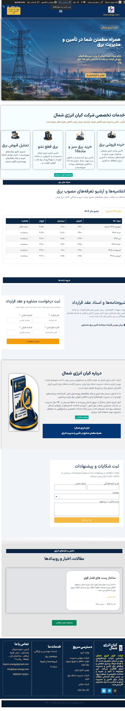
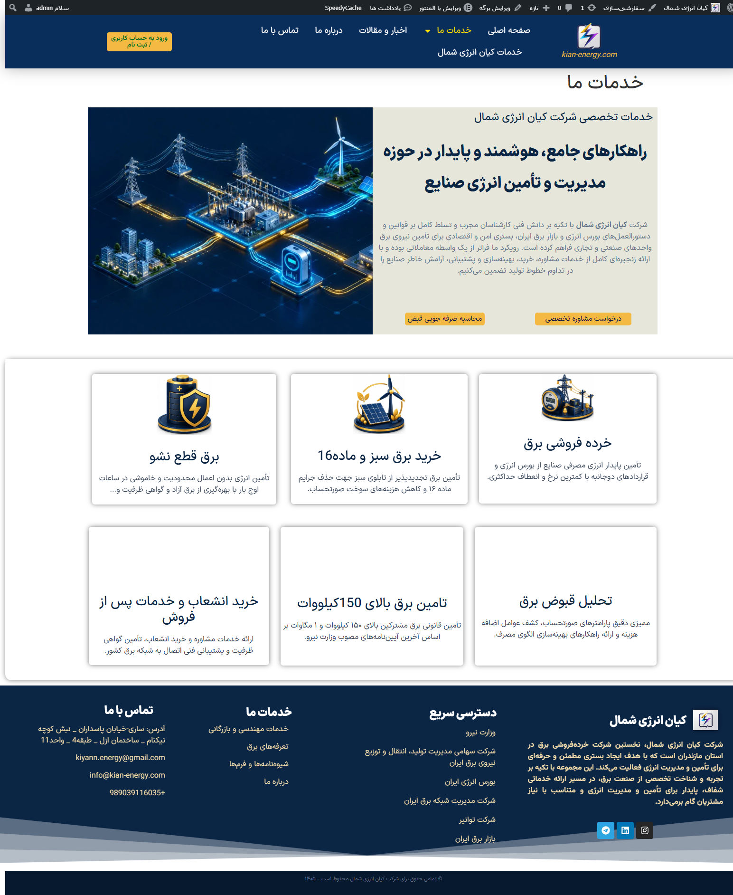
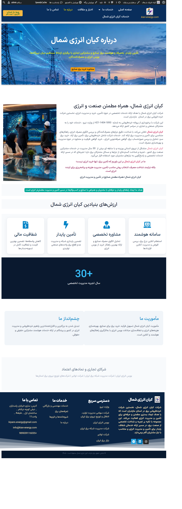
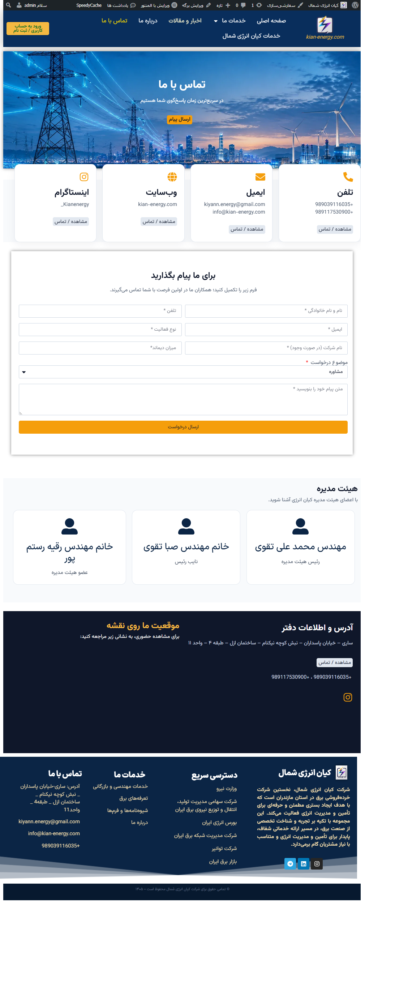
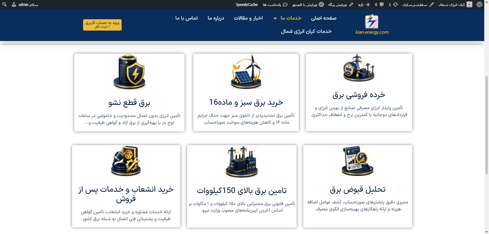
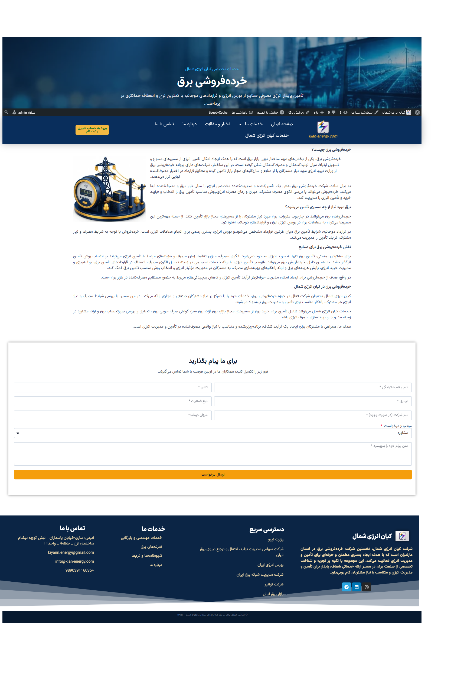
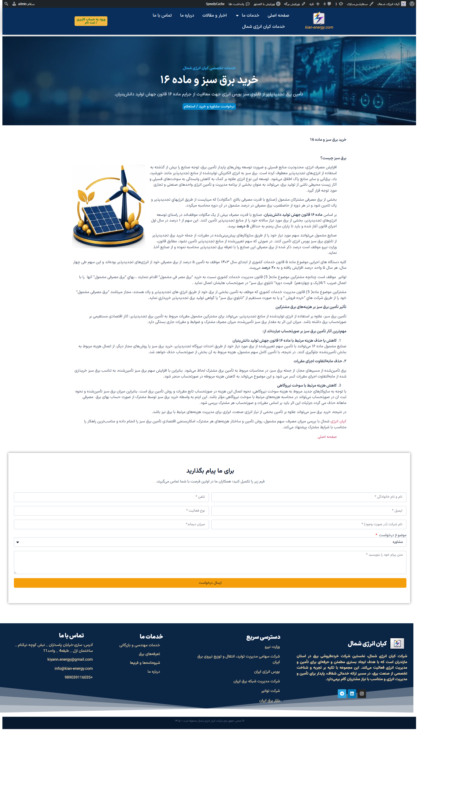
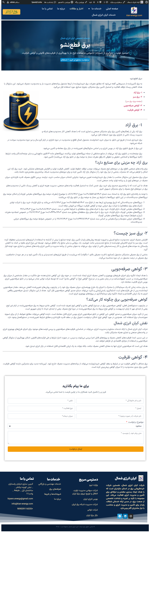

# Kian Energy

**Industry:** Energy & Gas  
**Role:** Lead Developer & Architect

### 🎯 Objective
Developing a corporate web portal to manage energy distribution information and showcase services.

### 🛠 Tech Stack
- WordPress
- Elementor Pro
- Custom CSS/JS

### 🖼 Preview 

[Visit Website](https://kian-energy.com)

## تصاویر پروژه کیان انرژی شمال:

## 📸 گالری تصاویر پروژه کیان انرژی شمال (پیش‌نمایش سریع)

> *برای مشاهده تصویر با کیفیت و ابعاد اصلی، روی هر پیش‌نمایش کلیک کنید.*

| صفحه اصلی | بخش معرفی خدمات | درباره ما |
| :---: | :---: | :---: |
|  | 
 |
  |

| **محصولات / پروژه‌ها** | **بلاگ و مقالات** | **تماس با ما** |
|  

|  | 

 |

---

## 🔍 بررسی بخش‌های مختلف سایت به تفکیک

  
<b>🔹 ۱. صفحه اصلی (Home Page)</b>

   
  
طراحی هدر، بنر اصلی و کال‌تو‌اکشن‌های هدفمند برای هدایت سریع کاربران به بخش‌های کلیدی انرژی.

  

  
<b>🔹 ۲. بخش معرفی خدمات (Services)</b>

   
  
ارائه ساختاریافته خدمات مهندسی و بازرگانی کیان انرژی با آیکون‌گرافی اختصاصی و کارت‌های مجزا.

  

  
<b>🔹 ۳. درباره ما (About Us)</b>

   
  
معرفی تاریخچه، اهداف استراتژیک، و گواهی‌نامه‌های تخصصی مجموعه.

  

<!-- 

  
<b>🔹 ۴. محصولات و تجهیزات (Products)</b>

   
  
کاتالوگ آنلاین تجهیزات و سیستم‌های تخصصی به همراه مشخصات فنی کامل.

  

 -->

<!-- 

  
<b>🔹 ۵. وبلاگ و آخرین اخبار (Blog)</b>

   
  
انتشار مقالات تخصصی حوزه انرژی با بهینه‌سازی کامل ساختار سئو محتوایی.

  

 -->

  
<b>🔹 ۶. تماس با ما و فرم ارتباطی (Contact)</b>

   
  
فرم اختصاصی درخواست مشاوره به همراه نقشه تعاملی و اطلاعات دسترسی دفاتر.

  

  
🔍 مشاهده بخش معرفی خدمات

   
  
     
  
     
  
     
  
  
  

<!--  -->

<!-- 

 -->
